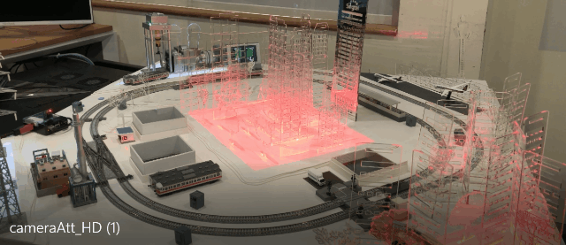
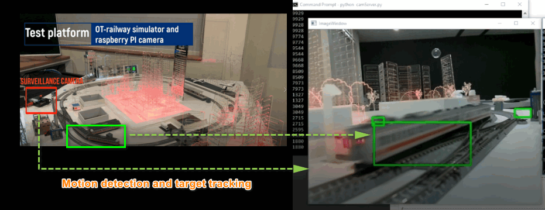
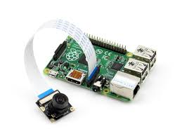
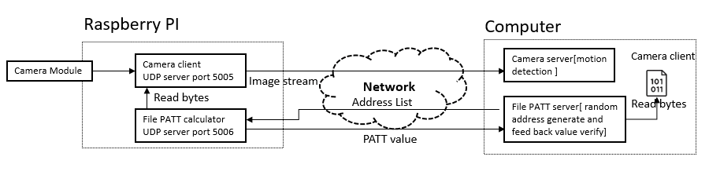

# Camera Firmware Attestation

#### 1. Introduction

This project contains two sections: 

**Camera Detection** : In this section we will create a camera video/image capture program(client) running on raspberry PI and send the camera image to the motion detection programming(server) running on the computer which connected to the raspberry PI. 

**Firmware attestation**: In this section we will create a firmware checker and verifier program to do the firmware attestation by using PATT algorithm.  The check running in raspberry PI will calculate the camera firmware( camera Client) 's PATT value based on the random bytes address send from the verifier. The verifier will compare the firmware's PATT value with its local file's calculation result to give the attestation result. 

###### Test Situation and Program UI View






------

#### 2. Program Setup

###### Development Environment

> Python 3.7.4, C

###### Additional Lib Need

1.  Python OpenCV (need to install for motion detection and target tracking)

   ```
   Raspberry PI install opencv: 
   
   sudo pip3 install opencv-contrib-python==3.4.3.18
   sudo apt-get install libhdf5-dev
   sudo apt-get install libatlas-base-dev
   sudo apt-get install libjasper-dev
   sudo apt-get install libqt4-test
   sudo apt-get install libqtgui4
   sudo apt-get update
   ```

2. numpy (need for image encode/decode)

   ```
   pip install numpyHardware (Raspberry PI3B+ with Camera module)
   ```

###### Hardware Need

Raspberry PI3B+ with Camera module. https://projects.raspberrypi.org/en/projects/getting-started-with-picamera



------

#### 3. System Design

###### Communication Protocol 

| The camera client+server and the PATT check+verifier will communicate with each other by UDP with different port. |
| ------------------------------------------------------------ |
| Camera client [ UDP server port: 5005]  <= image request <= Camera server [UDP client] |
| Camera client [ UDP server port: 5005]  => encoded image => Camera server [UDP client] |
| PATT checker [ UDP server port: 5006]  <= Random address list <= PATT verifier [UDP client] |
| PATT checker [ UDP server port: 5006]  => cameraClient PATT value => PATT verifier [UDP client] |



###### Program File List 

| Program File    | Execution Env | Description                                                  |
| --------------- | ------------- | ------------------------------------------------------------ |
| cameraClient.py | python3.7     | This module will create a client program running on raspberry PI to capture the camera image and feed the image back to connected camera server. |
| cameraServer.py | python3.7     | This module will create a camera viewer server to connect to the <camClient> by UDP client, get the camera video and do the motion detection and simple target tracking. |
| pattChecker.py  | python3.7     | This module will create a camera firmware PATT checking function. |
| pattClient.py   | python3.7     | This module create a file PATT check client and feed back the PATT value when the server connect and send address list to it. |
| pattServer.py   | python3.7     | This module will create a PATT file checker program. It will send the PATT bytes check list to the client and compare the feedback PATT value. |
| udpCom.py       | python3.7     | This module will provide a UDP client and server communication API. |
| udpComTest.py   | python3.7     | This module will provide a muti-thread test case program to test  the UDP communication modules by using port 5005. |
| firmwareSample  |               | firmware sample file used in test mode.                      |
| my_video.h264   |               | H264 video used to show the attacked situation.              |

------

#### 4. Program Usage

###### Run the Program

Run the program on Raspberry PI : 

```
python cameraClient.py
python pattClient.py
```

Run the program on Computer : 

```
python cameraServer.py
python pattServer.py
```


------

> Last edit by LiuYuancheng(liu_yuan_cheng@hotmail.com) at 26/03/2020