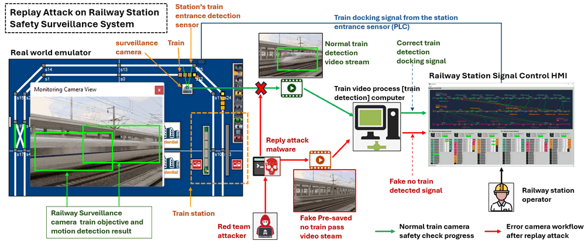
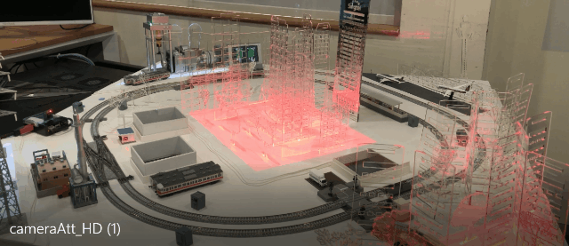
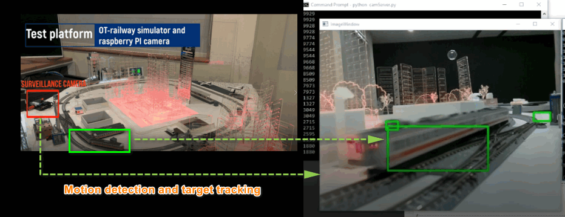
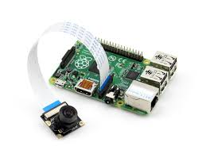
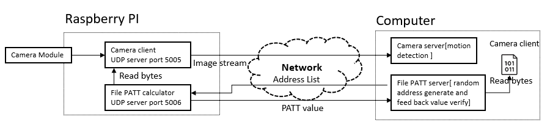
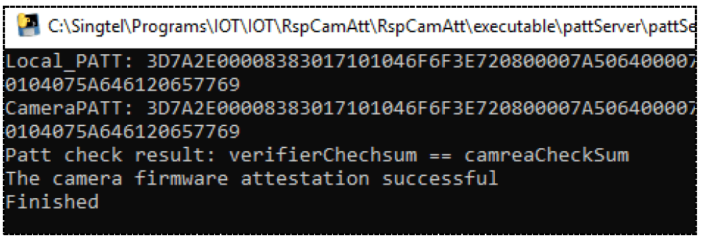

# OT Cyber Attack Case Study [Safety Camera Replay attack and Firmware Attestation]

**Program Design Purpose**: The objective of this cyber attack case study is aim to develop a workshop using the train detection safety camera system and the dynamic firmware attestation algorithm introduced in paper [PAtt: Physics-based Attestation of Control Systems](https://www.usenix.org/system/files/raid2019-ghaeini.pdf) to illustrate a practical demonstration of replay attack on a safety surveillance camera in railway OT-system. In the attack scenario, the replay attack is a advanced OT system cyber attacker based on a successful camera firmware attack and the station docking area train detection camera in the train surveillance system which used as a double safety mechanism of the train detection sensor.  The attack scenario involves a red team attacker planted a malicious firmware in the train detection camera, capturing video footage from the camera,  replaying then sending it back to station control room to mess up the safety surveillance system and station operator.



**Attacker Vector** : Firmware Attack, Replay Attack

>  Important : The demonstrated attack case is used for education and training for different level of IT-OT cyber security ICS course, please don't apply it on any real world system.

[TOC]

### Introduction

This project contains two main sections: 

**IOT Camera Detection** : In this section we will build a IOT IP camera [Raspberry PI] with target/motion detection function.  The video/image capture program(client) running on Raspberry PI will send the camera image to the motion detection programming(server) running on the computer which connected in the same LAN. 

**Firmware Update Attestation**: In this section we will create a firmware checker and a verifier program to do the firmware attestation by using PATT(Physics-based Attestation of Control Systems) algorithm.  The checker running in Raspberry PI will calculate the camera firmware (camera Client) 's PATT hash value based on the random bytes address send from the verifier. The verifier will compare the firmware's PATT value with its local file's calculation result to give the attestation result. 

**Demo Video Link**:  https://www.youtube.com/watch?v=nTv7dcfjZts

##### Test Situation and Program UI View

We install the camera inside a train-railway module to detect train pass and provide signal for the railway cross barriers controller. 



##### Cyber Attack Scenario 

**Firmware replacement attack**: Attack replaced the firmware update package with his malicious firmware program to make block the camera's video stream and send the pre-saved video (Normal simulation/train pass video) to the detection program then create the false feed back signal to the  railway cross barriers controller. 



`version: v_0.1`


------

### Program Setup

###### Development Environment

> Python 3.7.4, C

###### Additional Lib Need

1.  Python OpenCV (need to install for motion detection and target tracking)

   ```
   Raspberry PI install opencv: 
   
   sudo pip3 install opencv-contrib-python==3.4.3.18
   sudo apt-get install libhdf5-dev
   sudo apt-get install libatlas-base-dev
   sudo apt-get install libjasper-dev
   sudo apt-get install libqt4-test
   sudo apt-get install libqtgui4
   sudo apt-get update
   ```

2. numpy (need for image encode/decode)

   ```
   pip install numpyHardware (Raspberry PI3B+ with Camera module)
   ```

###### Hardware Need

Raspberry PI3B+ with Camera module. https://projects.raspberrypi.org/en/projects/getting-started-with-picamera




------

### System Design

##### Communication Protocol 

The system use UDP to do the camera video stream control and attestation checkout.

| The camera client+server and the PATT check+verifier will communicate with each other by UDP with different port. |
| ------------------------------------------------------------ |
| Camera client [ UDP server port: 5005]  <= image request <= Camera server [UDP client] |
| Camera client [ UDP server port: 5005]  => encoded image => Camera server [UDP client] |
| PATT checker [ UDP server port: 5006]  <= Random address list <= PATT verifier [UDP client] |
| PATT checker [ UDP server port: 5006]  => cameraClient PATT value => PATT verifier [UDP client] |

**Communication detail diagram is shown below**: 



##### Program File List 

| Program File    | Execution Env | Description                                                  |
| --------------- | ------------- | ------------------------------------------------------------ |
| cameraClient.py | python3.7     | This module will create a client program running on raspberry PI to capture the camera image and feed the image back to connected camera server. |
| cameraServer.py | python3.7     | This module will create a camera viewer server to connect to the <camClient> by UDP client, get the camera video and do the motion detection and simple target tracking. |
| pattChecker.py  | python3.7     | This module will create a camera firmware PATT checking function. |
| pattClient.py   | python3.7     | This module create a file PATT check client and feed back the PATT value when the server connect and send address list to it. |
| pattServer.py   | python3.7     | This module will create a PATT file checker program. It will send the PATT bytes check list to the client and compare the feedback PATT value. |
| udpCom.py       | python3.7     | This module will provide a UDP client and server communication API. |
| udpComTest.py   | python3.7     | This module will provide a muti-thread test case program to test  the UDP communication modules by using port 5005. |
| firmwareSample  |               | firmware sample file used in test mode.                      |
| my_video.h264   |               | H264 video used to show the attacked situation.              |


------

### Program Usage/Execution

##### Run the Program

Run the program on `Raspberry PI` : 

```
IOT IP camera program: python cameraClient.py
Attestation program checker: python pattClient.py
```

Run the program on `Host Computer` : 

```
IOT camera targets detection program: python cameraServer.py
Attestation program verifier: python pattServer.py
```

The Attestation program verifier will shown result as below: 



Detail usage please check the `Usage menu.pdf` in the doc folder. 


------


### Problem and Solution

N.A

------

### Reference

PATT firmware attestation: 

https://www.usenix.org/system/files/raid2019-ghaeini.pdf


------

> Last edit by LiuYuancheng(liu_yuan_cheng@hotmail.com) at 26/03/2020