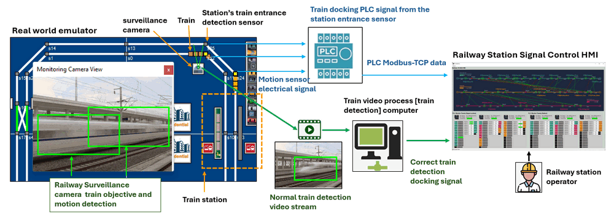
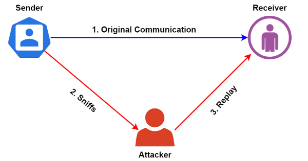
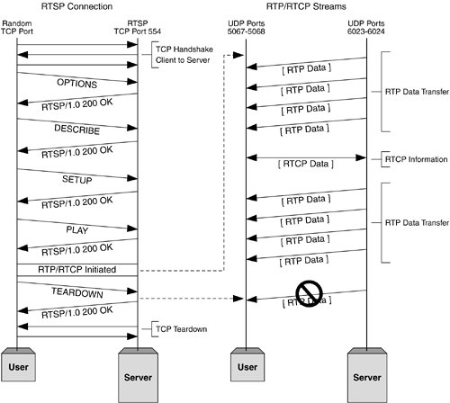
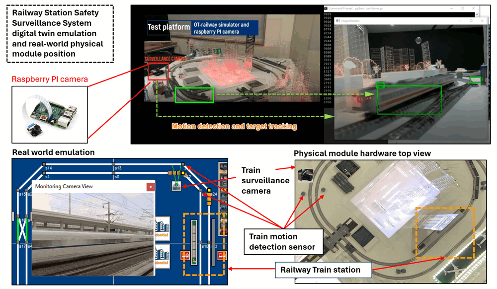
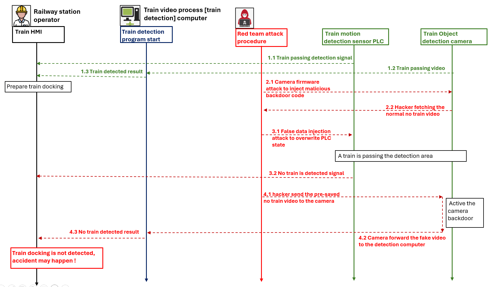
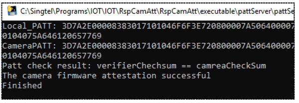

# OT Cyber Attack Case Study [ Safety Camera Replay Attack and Firmware Attestation ]

**Program Design Purpose**: The objective of this cyber attack case study is to develop a workshop aimed at showcasing a practical demonstration of a replay attack on a station train docking safety surveillance camera within a railway OT-system. In the attack scenario, the replay attack is executed by a sophisticated cyber attacker within the OT system, exploiting a successful camera firmware attack. Specifically, the attack targets the train detection camera located in the station docking area, which serves as a crucial safety mechanism for the train surveillance system. The scenario involves a red team attacker implanting malicious firmware into the train detection camera, thereby compromising its functionality. This compromised camera is then used to capture video footage, which is subsequently replayed and sent back to the station control room. The goal of this attack is to disrupt the safety surveillance system and deceive the station operator, highlighting the vulnerabilities inherent in OT systems and the potential impact of cyber attacks on critical infrastructure.

The attack progress overview diagram is shown below : 


**Attacker Vector** : Firmware Attack, Replay Attack

>  Important : The demonstrated attack case is used for education and training for different level of IT-OT cyber security ICS course, please don't apply it on any real world system.

Demo video : https://youtu.be/nTv7dcfjZts?si=h-ptx8jN6Gs1Q1JK

**Table of Contents**

[TOC]

- [OT Cyber Attack Case Study [ Safety Camera Replay attack and Firmware Attestation ]](#ot-cyber-attack-case-study---safety-camera-replay-attack-and-firmware-attestation--)
    + [Introduction](#introduction)
      - [Railway OT System Station Docking Assistant System Introduction](#railway-ot-system-station-docking-assistant-system-introduction)
      - [OT Station Docking Surveillance System Replay Attack Demo](#ot-station-docking-surveillance-system-replay-attack-demo)
      - [Key Tactics, techniques, and procedures (TTP) of Replay Attack](#key-tactics--techniques--and-procedures--ttp--of-replay-attack)
    + [Background Knowledge](#background-knowledge)
      - [Replay Attack](#replay-attack)
      - [Real Time Streaming Protocol](#real-time-streaming-protocol)
    + [Project Design](#project-design)
      - [Design of Railway OT System Station Docking Assistant System](#design-of-railway-ot-system-station-docking-assistant-system)
      - [Design of Surveillance Camera Replay Attack](#design-of-surveillance-camera-replay-attack)
    + [Program Setup](#program-setup)
          + [Development Environment](#development-environment)
          + [Additional Lib Need](#additional-lib-need)
          + [Hardware Need](#hardware-need)
        * [Program File List](#program-file-list)
    + [Program Usage/Execution](#program-usage-execution)
        * [Communication Protocol](#communication-protocol)
        * [Run the Program](#run-the-program)
    + [Problem and Solution](#problem-and-solution)
    + [Reference](#reference)


------

### Introduction

This case study aims to create a simplified emulation of the railway train detection surveillance system, which serves as a dual safety mechanism within the train station's docking assistant system. The primary objective is to illustrate the potential impact of a replay attack on the system using this platform. The project comprises two principal sections:

- **Railway OT System Station Docking Assistant System**: Within our railway emulation setup, we will devise a mechanism enabling station operators to manage rail docking procedures. This system incorporates a dual safety check mechanism utilizing both train position/motion sensors and train visual detection cameras. When either sensor detects a train in motion entering the station, it triggers the activation of the train brakes to reduce the train's speed.
- **OT System Replay Attack Demo**: This section will demonstrate a scenario where a red team attacker infiltrates the railway system OT network, then attack the docking's dual safety check mechanism through false data injection (FCI) attacks on the train position sensor signal control chain and disrupt the safety camera detection system via camera video replay attack.

The demonstration leverages the train detection safety camera system, false data injection, camera firmware attack, camera video replay attack and the dynamic firmware attestation algorithm outlined in the paper  [PAtt: Physics-based Attestation of Control Systems](https://www.usenix.org/system/files/raid2019-ghaeini.pdf). 


#### Railway OT System Station Docking Assistant System Introduction

Within our railway OT system, each station's entrance docking area is equipped with two distinct sensors: 

- One train motion and position detection sensor next to the railway.
- One train object detection surveillance camera facing to the docking area.

Both two sensors are tasked with detecting a train's movement as it enters the station. The system workflow is depicted in the image below:



 When a train approaches a station and enters the docking preparation zone:

- The position and motion detection sensor, connected to the station control PLC, detects the train's presence, prompting the PLC to dispatch a signal indicating the train's arrival to the station's HMI (depicted in the blue signal section of the workflow diagram).
- Simultaneously, the train object detection camera streams video footage of the passing train to a dedicated train detection computer. This computer utilizes computer vision (CV) object detection algorithms to identify the train and calculate its speed, subsequently sending this information to the HMI (illustrated in the green signal section of the workflow diagram).
- The HMI processes data from both the PLC and the train detection computer, assessing whether the train is decelerating and managing the station's operations accordingly.


#### OT Station Docking Surveillance System Replay Attack Demo

The attack demo will focus on compromising the two safety mechanisms: the train motion detection sensor and the train object detection camera.

For the motion detection sensor connected to the PLC, the red team attacker can manipulate its sensor state through a false data injection attack.

For the train object detection camera, it is hard for hacker to modify the byte data in the video stream via man in the middle attack. Instead, the attacker will implement a firmware attack on the camera to establish a "backdoor." Subsequently, the following steps will be executed to conduct the replay attack:

1. Initiate a firmware attack to inject a backdoor into the camera.
2. Utilize the camera's backdoor to record a video indicating no train detection.
3. Simultaneously with the false data injection attack on the PLC-HMI part, the attacker will transmit the pre-recorded video to the train detection computer, triggering the replay attack.

By combining the false data injection attack on the PLC and the replay attack on the camera, the red team attacker can disrupt the station docking assistant system, rendering the station HMI and operator unable to detect incoming trains for docking.


#### Key Tactics, techniques, and procedures (TTP) of Replay Attack

The tactics, techniques, and procedures (TTP) of a surveillance camera replay attack involve several steps that an attacker might take to intercept, manipulate, and replay video footage from a surveillance camera in an OT (Operational Technology) system. 

**Reconnaissance**

- **Tactics**: Identify the target surveillance camera or cameras within the OT system.
- **Techniques**: Gather information about the camera's make and model, location, network configuration, and any existing security measures.
- **Procedures**: The red team attacker will scan the network service to find the RTSP video server host by the camera, based on the camera admin page to find the camera's model then find some of the camera API from online document. 

**Interception and Analysis**

- **Tactics**: Monitor the communication between the surveillance camera and the monitoring/recording system.
- **Tactics**: Capture video footage and associated data packets as they are transmitted over the network.
- **Procedures**: The red team attacker will analyze the the camera connection packets detail to find the connected video process computer to identify the replay attack target. 

**Replay**

- **Tactics**: Replay the manipulated video footage to the monitoring/recording system or operators.
- **Tactics**: Ensure that the replayed footage aligns with the attacker's objectives, such as concealing unauthorized access, tampering, or other malicious activities.
- **Procedures** : The red team attack will send the pre-saved fake video to the video process computer to mess up the train detection safety mechanism. 


------

### Background Knowledge

In this section, we will introduce the basic knowledge of Replay Attack and Real Time Streaming Protocol which is used for sending the camera video to the train image CV detection computer.

#### Replay Attack

In OT system cyber attacks, the replay attack is frequently employed to target communication channels or control chains that utilize intricate protocols or handle large data flows. This method differs from traditional attack methods such as FDI/FCI (False Data Injection/False Command Injection) or Man-in-the-Middle (MitM) attacks. Instead of directly tampering with data or commands, a replay attack involves intercepting and retransmitting previously captured data packets. This approach can be particularly effective when dealing with complex protocols or high-volume data streams, allowing attackers to exploit vulnerabilities in the communication process without directly altering the transmitted information.

A replay attack is a type of network attack in which an attacker captures a valid network transmission and then retransmit it later. The main objective is to trick the system into accepting the retransmission of the data as a legitimate one. Additionally, replay attacks are hazardous because it’s challenging to detect. Furthermore, it can be successful even if the original transmission was encrypted.

An attacker can lunch a replay attack to gain unauthorized access to systems or networks. Furthermore, a replay attack can disrupt the regular operation of a system by inundating it with repeated requests. An attacker can plan to carry out this attack by intercepting and retransmitting data packets over a network. Additionally, a successful replay attack can be performed by replaying recorded audio or video transmissions.

A simple replay diagram is shown below: 



>  Reference : https://www.baeldung.com/cs/replay-attacks

A replay attack on a camera in an OT (Operational Technology) system involves capturing video footage from the camera, altering it or replaying it, and then sending it back to deceive the system or its operators. This type of attack can have various implications depending on the specific application of the camera within the OT system. 


#### Real Time Streaming Protocol

To make the replay attack can be easily implemented, the video protocol we use for the camera is the RTSP (unencrypted).  

The **Real-Time Streaming Protocol** (**RTSP**) is an [application-level](https://en.wikipedia.org/wiki/Application_layer) network [protocol](https://en.wikipedia.org/wiki/Communications_protocol) designed for [multiplexing](https://en.wikipedia.org/wiki/Multiplexing) and [packetizing](https://en.wikipedia.org/wiki/Network_packet#MPEG_packetized_stream) [multimedia](https://en.wikipedia.org/wiki/Multimedia) transport streams (such as [interactive media](https://en.wikipedia.org/wiki/Interactive_media), [video](https://en.wikipedia.org/wiki/Video) and [audio](https://en.wikipedia.org/wiki/Digital_audio)) over a suitable [transport protocol](https://en.wikipedia.org/wiki/Transport_layer). RTSP is used in entertainment and communications systems to control [streaming media](https://en.wikipedia.org/wiki/Streaming_media) [servers](https://en.wikipedia.org/wiki/Web_server). [RealNetworks](https://realnetworks.com/) developed RTSP in 1996, designed to control the entertainment and communication systems in a streaming server RTSP utilizes User Datagram Protocol ([UDP](https://getstream.io/blog/communication-protocols/#understanding-tcp-and-udp)) and Real-time Transport Protocol (RTP). RTSP is the standard [protocol used for streaming video](https://getstream.io/blog/streaming-protocols/) data from IP cameras and supports reliable segmented streaming, enabling users to watch streams while it's still being downloaded. The protocol also provides extensive customization options to help you build your own streaming applications and add new features. The main disadvantage of RTSP is that it isn't widely used for broadcasting multimedia over the Internet.

An example of RTSP in action with the video and audio data being delivered over a separate UDP-based RTP stream is shown below :



The protocol is used for establishing and controlling media sessions between endpoints. Clients of media servers issue commands such as *play*, *record* and *pause*, to facilitate real-time control of the media streaming from the server to a client ([video on demand](https://en.wikipedia.org/wiki/Video_on_demand)) or from a client to the server. 

> Reference https://www.informit.com/articles/article.aspx?p=169578&seqNum=3


------

### Project Design 

In this section we will introduce how we design the Railway OT system station docking  assistant system and the replay attack detail steps.

#### Design of Railway OT System Station Docking Assistant System

The train safety surveillance camera is constructed using a Raspberry Pi 3B+ equipped with a camera module. In the physical setup, preceding the designated slow-down zone of the railway station, two thermal reflection sensors are positioned. These sensors are linked to the PLC for train detection purposes. Adjacent to these sensors, our surveillance camera is installed to further detect approaching trains. The camera captures video footage, which is then transmitted to a dedicated video processing computer. Our program utilizes computer vision (CV) algorithms to perform both motion and train object detection.

The position of the camera and the sensor is shown below:



In our digital twin real-world emulator, we replicate this configuration faithfully. When a train passes through the sensor and camera detection area:

- The PLC converts the electrical signal from the sensors into digital format and transmits it to the Human-Machine Interface (HMI). The HMI displays the train detection result and, based on the detection time and train length, calculates the train's speed `speed-val-1`.
- Simultaneously, the motion detection program running on the camera's video processing computer triggers the train object detection algorithm to confirm the train's passage. Subsequently, it calculates the train's speed `speed-val-2`.

If either of the two speed values (`speed-val-1` and `speed-val-2`) exceeds the designated train docking speed, the station control HMI issues a signal to instruct the train to decelerate.

The detail operation scenario is shown below : 


 

#### Design of Surveillance Camera Replay Attack 

As illustrated in the preceding introduction to the Railway OT system station docking assistant system workflow, two safety mechanisms are in place: the train motion detection sensor and the train object detection camera. Regarding the motion detection sensor connected to the PLC, a malicious actor can alter its state through a false data injection attack. However, manipulating the byte data in the video stream of the train object detection camera via a man-in-the-middle attack proves challenging for hackers. Therefore, the attacker opts to execute a firmware attack on the camera, creating a "backdoor" to facilitate the replay attack, following these steps:

1. Implement a firmware attack to enable the camera to run modified firmware with a backdoor.
2. Utilize the camera's backdoor to record a video depicting the railway without a passing train.
3. Concurrently with the false data injection attack on the PLC-HMI interface, interrupt the video stream transmitted from the camera to the train detection computer. Subsequently, replay the pre-recorded video captured in the previous step.

The detail attack flow is shown below:



By employing the false data injection attack on the PLC and the replay attack on the camera, the red team attacker disrupts the station docking assistant system, rendering the station HMI and operator unable to detect approaching trains for docking.


------

### Program Setup

###### Development Environment

> Python 3.7.4, C

###### Additional Lib Need

1.  Python OpenCV (need to install for motion detection and target tracking)

   ```
   Raspberry PI install opencv: 
   
   sudo pip3 install opencv-contrib-python==3.4.3.18
   sudo apt-get install libhdf5-dev
   sudo apt-get install libatlas-base-dev
   sudo apt-get install libjasper-dev
   sudo apt-get install libqt4-test
   sudo apt-get install libqtgui4
   sudo apt-get update
   ```

2. numpy (need for image encode/decode)

   ```
   pip install numpyHardware (Raspberry PI3B+ with Camera module)
   ```

###### Hardware Need

Raspberry PI3B+ with Camera module. https://projects.raspberrypi.org/en/projects/getting-started-with-picamera


##### Program File List 

| Program File    | Execution Env | Description                                                  |
| --------------- | ------------- | ------------------------------------------------------------ |
| cameraClient.py | python3.7     | This module will create a client program running on raspberry PI to capture the camera image and feed the image back to connected camera server. |
| cameraServer.py | python3.7     | This module will create a camera viewer server to connect to the <camClient> by UDP client, get the camera video and do the motion detection and simple target tracking. |
| pattChecker.py  | python3.7     | This module will create a camera firmware PATT checking function. |
| pattClient.py   | python3.7     | This module create a file PATT check client and feed back the PATT value when the server connect and send address list to it. |
| pattServer.py   | python3.7     | This module will create a PATT file checker program. It will send the PATT bytes check list to the client and compare the feedback PATT value. |
| udpCom.py       | python3.7     | This module will provide a UDP client and server communication API. |
| udpComTest.py   | python3.7     | This module will provide a muti-thread test case program to test  the UDP communication modules by using port 5005. |
| firmwareSample  |               | firmware sample file used in test mode.                      |
| my_video.h264   |               | H264 video used to show the attacked situation.              |


------

### Program Usage/Execution

##### Communication Protocol 

The system use UDP to do the camera video stream control and attestation checkout.

| The camera client+server and the PATT check+verifier will communicate with each other by UDP with different port. |
| ------------------------------------------------------------ |
| Camera client [ UDP server port: 5005]  <= image request <= Camera server [UDP client] |
| Camera client [ UDP server port: 5005]  => encoded image => Camera server [UDP client] |
| PATT checker [ UDP server port: 5006]  <= Random address list <= PATT verifier [UDP client] |
| PATT checker [ UDP server port: 5006]  => cameraClient PATT value => PATT verifier [UDP client] |

**Communication detail diagram is shown below**: 


##### Run the Program

**Firmware Update Attestation**: In this section we will create a firmware checker and a verifier program to do the firmware attestation by using PATT(Physics-based Attestation of Control Systems) algorithm.  The checker running in Raspberry PI will calculate the camera firmware (camera Client) 's PATT hash value based on the random bytes address send from the verifier. The verifier will compare the firmware's PATT value with its local file's calculation result to give the attestation result. 

Run the program on `Raspberry PI` : 

```
IOT IP camera program: python cameraClient.py
Attestation program checker: python pattClient.py
```

Run the program on `Host Computer` : 

```
IOT camera targets detection program: python cameraServer.py
Attestation program verifier: python pattServer.py
```

The Attestation program verifier will shown result as below: 



Detail usage please check the `Usage menu.pdf` in the doc folder. 


------

### Problem and Solution

N.A

------

### Reference

- PATT firmware attestation:  https://www.usenix.org/system/files/raid2019-ghaeini.pdf
- RTSP video protocol: https://www.informit.com/articles/article.aspx?p=169578&seqNum=3
- Replay attack :  https://www.baeldung.com/cs/replay-attacks

------

> Last edit by LiuYuancheng(liu_yuan_cheng@hotmail.com) at 26/03/2020, , if you have any problem please free to message me.